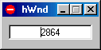

<div align="center">

## hWnd


</div>

### Description

Gives you the hWnd of the window that the mouse is over.
 
### More Info
 
Mouse movements

open the program and put the mouse over any window to find out its hWnd.

hWnd of window that the mouse is over.


<span>             |<span>
---                |---
**Submitted On**   |2000-06-01 20:38:58
**By**             |[mike causa](https://github.com/Planet-Source-Code/PSCIndex/blob/master/ByAuthor/mike-causa.md)
**Level**          |Beginner
**User Rating**    |3.5 (14 globes from 4 users)
**Compatibility**  |VB 5\.0, VB 6\.0
**Category**       |[Complete Applications](https://github.com/Planet-Source-Code/PSCIndex/blob/master/ByCategory/complete-applications__1-27.md)
**World**          |[Visual Basic](https://github.com/Planet-Source-Code/PSCIndex/blob/master/ByWorld/visual-basic.md)
**Archive File**   |[CODE\_UPLOAD6296612000\.zip](https://github.com/Planet-Source-Code/mike-causa-hwnd__1-8518/archive/master.zip)

### API Declarations

```
Included with the zip
Thankz for downloading this code.
```


